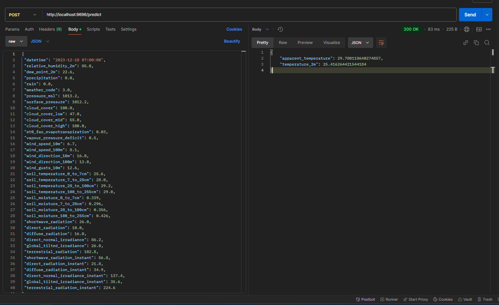

# Manila Temperature Prediction

This project is a Capstone Project Submission of [Machine Learning Zoomcamp](https://github.com/DataTalksClub/machine-learning-zoomcamp/tree/master) by [Alexey Grigorev](https://github.com/alexeygrigorev)

## About the Project

Manila, the capital city of the Philippines, is one of the most densely populated urban centers in the world. Accurate and reliable temperature forecasting is crucial for various reasons that directly impact the lives of its residents, infrastructure, and economy.

This project aims to build a predictive model that leverages historical hourly weather data to forecast:

- Temperature at 2 meters: The actual air temperature.
- Apparent temperature: A measure of how hot it feels, factoring in humidity and other conditions.
  By addressing this need, the project contributes to creating actionable insights for better urban management, resource allocation, and long-term sustainability in Manila.

## Data

The datas used in this project can be found at Kaggle:

- [Philippine Cities Weather Data (2024)](https://www.kaggle.com/datasets/bwandowando/philippine-cities-weather-data-ytd-2024)
- [Philippine Cities Weather Data (2020-2023)](https://www.kaggle.com/datasets/bwandowando/philippine-cities-weather-data-2020-2023)

Due to file size, the datasets are also stored at google drive as a backup.

- [Philippine Cities Weather Data (2024) - Google Drive](https://drive.google.com/file/d/10wxJ3x6NKIGQCL5xpngcgbja6M7hvqJf/view?usp=drive_link)
- [Philippine Cities Weather Data (2020-2023) - Google Drive](https://drive.google.com/file/d/1cwdqQC3Idr7rfCS2AMbROv3be0eZ0SIB/view?usp=drive_link)

The dataset contains daily and hourly weather data of 135 cities from 2020 - 2023 and 2024, but this project focused on hourly weather data and 1 city (Manila) to perform predictions.
It also a total of 44 parameters and its definitions can be found at [open-mateo API](https://open-meteo.com/en/docs/historical-weather-api)

## Project Structure

```sh
📦ml-zoomcamp-temp-prediction
 ├─📂 archive                                 <--- draft files
 ├─📂 code                                    <--- the files contained in docker image
 │  ├─── Dockerfile
 │  ├─── model.bin
 │  ├─── Pipfile
 │  ├─── Pipfile.lock
 │  └─── predict.py
 ├─📂 data
 │  ├─── combined_hourly_data_mnl.parquet     <--- cleaned data in parquet format
 │  ├─── Readme.md                            <--- links for downloading the dataset
 │  └─── test_data.parquet                    <--- the test data in parquet format
 ├─── .gitignore                              <--- .gitignore config
 ├─── .gitpod.yml                             <--- config when using Gitpod (devcontainers alternative)
 ├─── generate_test_data_input.py             <--- script for generating input test data
 ├─── notebook_eda.ipynb                      <--- notebook for Data prep, cleaning and EDA
 ├─── notebook_model.ipynb                    <--- notebook for model training and hyperparameter tuning
 ├─── Pipfile                                 <--- pipenv dependencies
 ├─── Pipfile.lock                            <--- pipenv dependencies
 ├─── Readme.md
 ├─── test.py                                 <--- model test prediction script
 └─── train.py                                <--- final model training script
```

## Environment Setup

Create conda environment. Replace `<ENVIRONMENT_NAME>` with your desired name

```sh
conda create -n <ENVIRONMENT_NAME> python=3.11
```

```sh
activate conda env
conda activate <ENVIRONMENT_NAME>
```

install pipenv

```sh
conda install pipenv
```

Setup pipenv environment and install dependencies from the Pipfile.

```sh
pipenv install
```

activate env

```sh
pipenv shell
```

## Run locally using Docker Service

Build docker image inside the `code` directory

```bash
docker build -t temp_prediction:v1 .
```

Run docker image

```bash
docker run -it -p 9696:9696 --rm temp_prediction:v1
```

Test the running docker image in three (3) ways:

- test script with default input data

```bash
python test.py
```

- test script with random test data input

```bash
python test.py -i="$(python generate_test_data_input.py)"
```

- using the postman or similar.

  - Choose `POST` as the http method
  - Link: `http://localhost:9696/predict`
  - In the payload, choose the `Body`, `JSON` and `raw`.
  - Paste the input at the left text field (generate from `generate_test_data_input.py`)
  - Press `Send` and the output will be at the right text field


